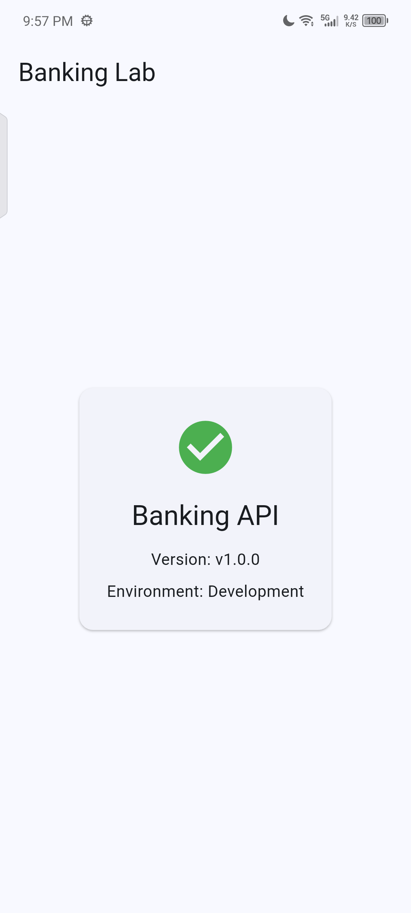

# Banking Lab Development Fundamentals and Current Setup

- **Document ID:** BL-LEARN-001
- **Audience:** Beginner developer / project owner
- **Purpose:** A reusable explanation of the tools, architecture, and verified foundations completed during BL-SETUP-001 and early BL-MOB-002
- **Last verified:** 02 September 2026
- **Scope:** Educational banking simulator using fake money and test data only

> This document preserves the learning history and earlier approved design baseline. For current execution status use [task.md](task.md); for the 2026-09-04 policy reconciliation proposal use the [authentication repair plan](../02_Planning/plan-authentication-repair.md). Older statements that endpoints do not exist or migrations are unapplied describe their historical slice, not today's working tree. This is not a production deployment guide, security certification, or authorization to operate a real financial service.

## 1. What Banking Lab Is Becoming

Banking Lab is planned as a client-server application with three primary layers:

```text
Android phone
Flutter mobile application
        |
        | HTTP requests and JSON responses
        v
ASP.NET Core backend API
        |
        | Entity Framework Core / SQL
        v
PostgreSQL database
```

The mobile application displays information and collects user actions. The backend is the trusted system that will eventually validate permissions and banking rules. PostgreSQL stores permanent structured data.

The mobile application must not directly change balances or connect directly to PostgreSQL. Sensitive operations must be accepted, validated, authorized, and recorded by the backend.

## 2. Languages, Frameworks, and Tools

| Name                  | Category                     | Current purpose                                    |
| --------------------- | ---------------------------- | -------------------------------------------------- |
| Dart                  | Programming language         | Mobile application source code                     |
| Flutter               | UI framework and SDK         | Builds the Dart application for Android            |
| C#                    | Programming language         | Backend source code                                |
| .NET                  | Runtime and SDK              | Compiles and runs C#                               |
| ASP.NET Core          | Web/API framework            | Receives HTTP requests and returns responses       |
| SQL                   | Database language            | Queries and modifies relational data               |
| PostgreSQL            | Database management system   | Stores permanent application data                  |
| Entity Framework Core | Object-relational mapper     | Maps C# entities to PostgreSQL tables              |
| Npgsql                | PostgreSQL provider for .NET | Lets EF Core communicate with PostgreSQL           |
| Docker                | Container platform           | Runs the local PostgreSQL environment              |
| Git                   | Version-control system       | Records source and documentation history           |
| JSON                  | Data format                  | Carries structured data between mobile and backend |
| HTTP                  | Network protocol             | Defines requests and responses between systems     |

### Important terminology

- Dart and C# are **languages**.
- Flutter and ASP.NET Core are **frameworks**.
- An SDK is a set of tools used to build software for a platform.
- A runtime provides the environment in which compiled software executes.
- A dependency or package is reusable code added to a project.

## 3. What Runs on Each Machine

### On the Android phone

The installed application contains the compiled Dart code, Flutter framework functionality, the Flutter rendering engine, package code, and a small Android host layer.

In debug mode, Flutter supports hot reload through the Dart development runtime. In a release build, Dart is compiled ahead of time for the phone's processor.

ASP.NET Core and PostgreSQL do not run inside the phone in the current architecture.

### On the development computer

The computer currently runs:

- The ASP.NET Core backend process.
- PostgreSQL 17 inside Docker.
- Flutter and Android build tools.
- ADB for communication with the physical Android phone.
- Git and the project files.

During local development, the computer temporarily acts as the backend server. In a future deployment, ASP.NET Core and PostgreSQL would move to controlled server infrastructure.

## 4. How Dart Communicates with C#

Dart does not call C# functions directly. The Flutter application and ASP.NET Core backend communicate using HTTP and JSON, which are language-independent standards.

The current contract is:

```http
GET /api/v1/system/info
```

The backend returns HTTP status `200 OK` and JSON shaped like:

```json
{
  "name": "Banking API",
  "version": "v1.0.0",
  "environment": "Development"
}
```

The current Flutter flow is:

```text
Flutter screen
    -> Riverpod provider / ViewModel
    -> repository
    -> Dio API service
    -> HTTP GET request
    -> ASP.NET Core endpoint
    -> JSON response
    -> typed Dart SystemInfo model
    -> loading, success, or failure UI
```

The two applications only need to agree on the API contract:

- HTTP method
- URL path
- required headers
- request body or parameters
- response status code
- JSON field names and data types
- error behavior

The backend could be written in another server language and the Flutter app could remain unchanged if the HTTP contract stayed compatible.

## 5. Why Flutter Must Not Connect Directly to PostgreSQL

Database credentials placed in a mobile application can be extracted from the installed APK. A malicious user could bypass the UI and issue database commands directly.

The required trust boundary is:

```text
Untrusted client (Flutter) -> Trusted backend (ASP.NET Core) -> PostgreSQL
```

The backend will eventually be responsible for checks such as:

- Is the user authenticated?
- Does the user own the account?
- Is the requested operation allowed?
- Is the amount valid?
- Is the balance sufficient?
- Is this a duplicate request?
- Should the operation be audited?

Hiding a button in Flutter is not security. Important rules must be enforced by the backend.

## 6. Repository and Git Fundamentals

The main project layout is:

```text
banking-lab/
  backend/          ASP.NET Core API and migrations
  mobile/           Flutter mobile application
  infrastructure/   Docker Compose and temporary EF setup
  docs/             Controlled guides and project notes
  scripts/          Future helper scripts
```

Git records file history as commits. Common `git status` indicators are:

| Indicator | Meaning                               |
| --------- | ------------------------------------- |
| `M`     | Modified tracked file                 |
| `A`     | Added/staged file                     |
| `D`     | Deleted tracked file                  |
| `??`    | Untracked file                        |
| `AM`    | Added to staging, then modified again |

The root `.gitignore` excludes local secrets and generated files, including:

- `.env` files except a safe `.env.example`
- .NET `bin/` and `obj/`
- Flutter `.dart_tool/` and build output
- IDE-specific settings
- test output
- local database files and dumps

`.gitignore` is not encryption and does not erase an already committed secret. It prevents matching untracked files from being added in normal Git operations.

## 7. Docker and PostgreSQL Fundamentals

The local database is described by `infrastructure/compose/compose.dev.yml`.

### Docker concepts

- **Image:** reusable template, currently `postgres:17`.
- **Container:** running PostgreSQL instance created from the image.
- **Volume:** persistent storage for PostgreSQL data.
- **Compose file:** configuration recipe for services, ports, environment, storage, and health checks.

The port mapping is:

```text
Windows localhost:5432 -> PostgreSQL container:5432
```

The named volume is `banking_pgdata`. A normal Compose shutdown preserves it. Running Compose down with `-v` intentionally deletes the volume and local database data.

The health check uses `pg_isready` to confirm that PostgreSQL is accepting connections for the configured development database and user.

### Verified database identifiers

- Database: `banking_lab`
- Development role: `banking_app`
- Port: `5432`

No real password is included in this document.

### Port-conflict lesson

A native Windows PostgreSQL service previously occupied port `5432`. The backend reached that server instead of the Docker container and reported password authentication failures. Stopping the conflicting service allowed Docker to own the intended host port.

This demonstrated that only one process can normally listen on the same IP-address-and-port combination.

## 8. Secrets and Configuration

Docker Compose reads the development PostgreSQL password from an untracked `.env` file.

The ASP.NET Core connection string is stored with .NET user secrets. The project file contains a `UserSecretsId`, but the actual connection string is stored outside the repository in the Windows user profile.

A connection string identifies how the backend reaches PostgreSQL:

```text
Host=localhost;
Port=5432;
Database=banking_lab;
Username=banking_app;
Password=<local-development-password>;
```

Documentation and committed configuration must use placeholders rather than real credentials.

## 9. ASP.NET Core Fundamentals

The backend entry point is `backend/Banking.api/Program.cs`.

Its current responsibilities are:

1. Create the application builder.
2. Register `AppDbContext` through dependency injection.
3. Build the web application.
4. Map `GET /api/v1/system/info`.
5. Start listening for requests.

The development backend has been run on port `5255`.

This command listens through every suitable network interface during local testing:

```powershell
dotnet run --urls "http://0.0.0.0:5255"
```

This HTTP configuration is for controlled local development. Production traffic must use an appropriate HTTPS deployment configuration.

## 10. Entity Framework Core and Migrations

Entity Framework Core is an object-relational mapper:

```text
C# entities <-> EF Core/Npgsql <-> PostgreSQL tables
```

The temporary `AppDbContext` exposes:

```csharp
DbSet<SetupProbe> SetupProbes
```

The `SetupProbe` entity contains:

- `Id`: integer primary key
- `Status`: required text
- `CheckedAt`: timestamp with time zone

The applied `InitialSetupProbe` migration created the `SetupProbes` table. EF Core also tracks applied migrations in `__EFMigrationsHistory`.

Applying the migration proved that the backend could authenticate, connect, and execute schema commands. The migration creates the table; it does not automatically guarantee that a `SetupProbe` row exists.

A migration contains:

- `Up()`: changes used when applying the migration.
- `Down()`: reversal instructions used when rolling it back deliberately.

## 11. Flutter and Android Fundamentals

The Flutter entry point is `mobile/banking_mobile/lib/main.dart`. It now delegates startup to `lib/app/bootstrap.dart`, while `lib/app/app.dart` contains the application-level widget.

Application startup currently performs these steps:

1. `main()` calls `bootstrap()`.
2. `bootstrap()` reads `API_BASE_URL` from `--dart-define`.
3. `AppConfig` validates that it is a complete URL.
4. `bootstrap()` creates Riverpod's root `ProviderScope`.
5. It overrides `appConfigProvider` with the validated configuration.
6. It mounts `BankingLabApp` from `app.dart`.
7. `BankingLabApp` displays `SystemInfoScreen`.

`BankingLabApp` is a `StatelessWidget` responsible for application-level configuration such as the Material theme and starting screen.

This separation gives each file one main responsibility:

| File | Responsibility |
| --- | --- |
| `lib/main.dart` | Small executable entry point |
| `lib/app/bootstrap.dart` | Configuration and root dependency wiring |
| `lib/app/app.dart` | Material application, theme, and starting screen |
| `lib/core/api/dio_provider.dart` | Shared Dio API client configuration |

The refactor changes file organization only. It preserves the API base URL, Dio settings, Riverpod override, starting screen, UI states, and request behavior.

`SystemInfoScreen` is a `ConsumerWidget`. A `ConsumerWidget` can use a `WidgetRef` to watch Riverpod providers.

The screen runs:

```dart
final systemInfoAsync = ref.watch(systemInfoProvider);
```

The provider returns an `AsyncValue<SystemInfo>`. This represents three possible states:

```text
Loading -> request has not completed
Data    -> request completed successfully
Error   -> request failed
```

The screen uses `systemInfoAsync.when()` to select the appropriate UI:

- Loading displays a progress indicator.
- Success displays API name, version, and environment.
- Failure displays a safe error message.
- **Try again** invalidates the provider and starts another request.

### Widget concept

Flutter describes interfaces using widgets. Text, buttons, layouts, themes, screens, loading indicators, and navigation are all represented by widgets.

Widgets should display state and capture user actions. They should not own database credentials, backend authorization rules, or authoritative banking calculations.

### Android tools

- Android SDK Platform: APIs used when compiling.
- Android Build Tools: packages the Android application.
- Android Platform Tools: includes ADB.
- Android Command-line Tools: manages installed SDK components.
- Android Studio: IDE and SDK manager; it does not need to stay open.
- Android Emulator: optional because a physical device is being used.

The Android compile SDK can be newer than the phone's Android version. Compatibility also depends on the application's minimum supported SDK.

### ADB and wireless debugging

ADB is the Android Debug Bridge. Pairing establishes trust; connecting opens the debugging session. Flutter uses ADB to discover the phone, install the debug APK, launch the application, stream logs, and support debugging.

### What `flutter run` performs

1. Reads and compiles Dart code.
2. Uses Gradle and Android build tools.
3. Creates `app-debug.apk`.
4. Transfers the APK through ADB.
5. Installs and launches it on the phone.
6. Connects the Dart debugger and hot-reload service.

The first build is slower because Gradle and Android dependencies may need to be downloaded and prepared.

## 12. Development Commands and Their Purposes

| Command                       | Purpose                                                  |
| ----------------------------- | -------------------------------------------------------- |
| `flutter run`               | Build, install, launch, and debug the app                |
| `flutter analyze`           | Find Dart type, syntax, lint, and static-analysis issues |
| `flutter test`              | Run automated Flutter tests                              |
| `flutter devices`           | List targets recognized by Flutter                       |
| `dotnet run`                | Build and run the ASP.NET Core backend                   |
| `dotnet build`              | Compile the backend without starting it                  |
| `dotnet ef migrations list` | Show known EF Core migrations and applied status         |
| `dotnet ef database update <reviewed-target>` | Apply through one explicitly reviewed migration; never run unqualified while later migrations are pending |
| `docker compose ... ps`     | Show Compose service state and health                    |
| `Invoke-RestMethod <URL>`   | Send an HTTP request from PowerShell                     |

During `flutter run`:

- `r`: hot reload
- `R`: hot restart
- `q`: quit and return to PowerShell
- `d`: detach while leaving the app running

Long-running backend and Flutter processes normally use separate terminal tabs.

## 13. Networking Fundamentals

A development API URL has these parts:

```text
http://192.168.x.x:5255/api/v1/system/info
|      |             |    |
scheme host          port path
```

- `localhost` means the current device.
- On the PC, `localhost` means the PC.
- On the phone, `localhost` means the phone.
- `0.0.0.0` tells a server to listen on available network interfaces.
- A client uses the PC's real private LAN address, not `0.0.0.0`.
- Windows Firewall should expose the development server only on the intended private network.

Opening the endpoint in the phone browser first verified:

```text
Phone browser -> local network -> Windows -> ASP.NET Core -> JSON response
```

The completed Flutter vertical slice later verified:

```text
Flutter screen
    -> Riverpod
    -> repository
    -> Dio
    -> local network
    -> ASP.NET Core
    -> JSON
    -> typed Dart model
    -> Flutter screen
```

The live phone screen displayed `Development`, while the automated test displayed `Test`. This proves that the screen renders values supplied by its provider rather than hardcoded API information.

### Verified phone result



The system-info endpoint does not currently query PostgreSQL. It verifies mobile-to-backend connectivity, not a complete mobile-to-database request.

## 14. Installed Flutter Packages

The current `pubspec.yaml` includes:

### Application dependencies

- `flutter_riverpod`: state management and dependency provision.
- `dio`: HTTP client for API calls.
- `go_router`: application navigation and route protection later.
- `freezed_annotation`: annotations for immutable generated models.
- `json_annotation`: annotations for generated JSON conversion.
- `flutter_secure_storage`: protected refresh-token storage boundary.

### Development dependencies

- `build_runner`: runs Dart code generators.
- `freezed`: generates immutable Dart model code.
- `json_serializable`: generates JSON parsing and serialization.
- `flutter_test`: Flutter test framework.
- `flutter_lints`: static-analysis and style rules.

Installing a package only makes its code available; it does not automatically integrate the package into the application.

Currently used:

- Riverpod for configuration, dependency provision, asynchronous state, and test overrides.
- Dio for the system-info HTTP request.
- `flutter_secure_storage` for the mobile refresh-token storage boundary.
- Flutter Test for unit and widget tests.

Installed for later work but not yet integrated:

- `go_router`
- Freezed and generated JSON serialization

`pubspec.yaml` declares acceptable dependency constraints. `pubspec.lock` records the exact dependency versions resolved for reproducible builds.

## 15. Singleton and Dependency Lifetimes

A singleton is one shared object instance within a defined application lifetime.

```text
One configured Dio client
    -> system-info repository
    -> authentication repository
    -> accounts repository
```

Sharing one configured Dio client can centralize the base URL, timeouts, headers, authentication interceptors, safe logging rules, and reusable HTTP connections.

A singleton is not global across all devices. Each phone process has its own instance. Restarting the application creates a new lifetime. The backend process has separate instances of its own services.

Common dependency lifetimes are:

| Lifetime  | Meaning                                                        |
| --------- | -------------------------------------------------------------- |
| Singleton | One instance for the application/container lifetime            |
| Scoped    | One instance for a defined scope, commonly one ASP.NET request |
| Transient | A new instance each time it is requested                       |

`AppDbContext` is normally scoped per ASP.NET request, not singleton. A shared singleton DbContext could cause concurrency, stale tracking, and cross-request problems.

Riverpod providers can supply singleton-like shared instances within a `ProviderScope`, while still allowing controlled disposal, recreation, and test overrides.

Do not make every object a singleton. Shared infrastructure may benefit from controlled reuse, while screen-specific values and request-specific database tracking need shorter lifetimes.

## 16. Current Verified Status

| Area | Status |
| --- | --- |
| Git repository structure | Created |
| Secret and build-output ignore rules | Configured |
| Docker PostgreSQL | Healthy during verification |
| PostgreSQL credentials and connection | Verified |
| EF Core migration | Applied |
| ASP.NET Core build and startup | Verified |
| `GET /api/v1/system/info` | Returns live JSON |
| Flutter Android project | Builds and installs |
| Physical Infinix device | Connected through wireless ADB |
| Flutter system-info screen | Displays live backend values |
| Environment-aware API URL | Implemented |
| Dio client and API service | Implemented |
| Repository and Riverpod provider | Implemented |
| Shared typed `AppFailure` hierarchy | Implemented and tested |
| Dio and response-parsing error mapping | Implemented and tested |
| Safe typed failure messages in the System Info UI | Implemented and tested |
| Loading, success, and failure UI | Verified |
| Retry behavior | Verified |
| Flutter analyzer | Passed |
| Flutter automated tests | Passed |
| Flutter startup structure (`main`, bootstrap, app shell) | Implemented and verified |
| Flutter-to-ASP.NET request | Verified on physical phone |
| Mobile secure session storage boundary | Implemented and tested |
| Android secure-storage backup exclusions | Configured and debug APK build verified |
| Mobile authentication repository local-session foundation | Implemented and tested; API operations pending |
| Authentication and authorization | Not implemented |
| Accounts, balances, transfers, and transactions | Not implemented |
| Production deployment and hardening | Not implemented |

## 17. Completed Setup Milestone

The first end-to-end vertical slice in `BL-SETUP-001` Section 8 is complete.

Verified flow:

```text
SystemInfoScreen
    -> Riverpod FutureProvider
    -> SystemInfoRepository
    -> SystemInfoApiService
    -> Dio GET /api/v1/system/info
    -> ASP.NET Core
    -> JSON response
    -> typed SystemInfo model
    -> loading, success, or failure UI
```

Section 9, local Caddy, is optional and has been skipped during early development because direct local HTTP works on the physical Android device.

The `BL-SETUP-001` acceptance checks are complete:

```text
PostgreSQL healthy
-> EF migration applied
-> ASP.NET Core build and test command passed
-> Flutter analyze and tests passed
-> physical-phone API request verified
-> developer documentation updated
-> Git contents and secret exclusions reviewed
```

Work is now progressing through `BL-MOB-002`, Flutter Mobile Architecture and UI Engineering.

The following mobile foundations have been implemented and verified:

- Application startup separated into `main.dart`, `bootstrap.dart`, and `app.dart`.
- Riverpod's root `ProviderScope` configures application-wide dependencies.
- Dio provides the shared HTTP client.
- API and response-processing failures are converted into typed `AppFailure` objects.
- The System Info screen displays user-safe failure messages and supports retrying.
- Unit and widget tests cover the completed behavior.

Authentication, route protection, registration, and login are not implemented yet. MOB-005 secure session storage is complete and verified. MOB-006, the mobile authentication repository boundary, is the current hands-on milestone; the backend still has no login, refresh, or logout endpoints, so mobile work must not present a stored token as proof of an authenticated session.

## 18. Typed Error Handling in Flutter

The MOB-004 milestone introduced a consistent path for handling failures without exposing raw technical exceptions to users.

The error flow is:

```text
Dio or JSON parsing throws an error
    -> SystemInfoRepository catches the error
    -> mapApiError classifies it
    -> an AppFailure is thrown
    -> Riverpod stores it in AsyncValue.error
    -> SystemInfoScreen displays its safe message
```

### Why use `AppFailure`?

Packages such as Dio produce technical errors intended for developers. Those errors may contain details that are confusing or inappropriate to show directly in the interface.

`AppFailure` gives the application a controlled vocabulary:

- `NetworkFailure`: the server cannot be reached.
- `TimeoutFailure`: the request took too long.
- `ServerFailure`: the server returned an unsuccessful response.
- `InvalidResponseFailure`: the response does not match the expected contract.
- `RequestCancelledFailure`: the request was cancelled.
- `UnexpectedFailure`: a safe fallback for an unknown problem.

This structure is modular because the screen does not need to understand Dio's exception types.

### Why validate JSON explicitly?

Dart's JSON values initially have runtime types such as `String`, `int`, `bool`, `List`, `Map`, or `null`.

`SystemInfo.fromJson` verifies that `name`, `version`, and `environment` are strings. If a required field is missing or has the wrong type, it throws `FormatException`.

The error mapper converts that parsing exception into `InvalidResponseFailure`. This tells the application that the server responded, but its data did not match the expected API contract.

### Why does the screen still use `if/else`?

Riverpod exposes the error value as `Object`, which means a provider or test could theoretically throw any error type.

The screen checks:

```dart
if (error is AppFailure) {
  failure = error;
} else {
  failure = const UnexpectedFailure();
}
```

The `if` branch uses an already classified failure. The `else` branch prevents an unknown object from causing another crash while the application is trying to display an error.

Modular design does not eliminate conditions. It places each decision in the layer that owns that responsibility.

### Error-handling responsibilities

| Layer | Responsibility |
| --- | --- |
| Dio API service | Performs the HTTP request |
| Data model | Validates the expected JSON structure |
| Error mapper | Converts technical errors into application failures |
| Repository | Catches lower-level errors and applies the mapper |
| Riverpod provider | Exposes loading, data, or error state |
| Flutter screen | Displays a safe message and retry action |

### Testing lessons

The completed tests verify that:

- Connection errors become `NetworkFailure`.
- Timeouts become `TimeoutFailure`.
- Server responses preserve their HTTP status code.
- Invalid response data becomes `InvalidResponseFailure`.
- Cancellation becomes `RequestCancelledFailure`.
- Existing `AppFailure` objects are not unnecessarily replaced.
- Unknown errors use `UnexpectedFailure`.
- The System Info screen displays the safe typed message.
- Tapping **Try again** causes the provider to run again.

The automated tests do not use a real network connection. Dio errors and Riverpod results are created deliberately so the tests remain fast and repeatable.

The complete Flutter formatting, analysis, and automated test commands passed after this milestone.

### Current limitations

This milestone handles errors in the current System Info vertical slice. It does not yet implement:

- A standardized backend error-response contract.
- Authentication-specific failures.
- Form-field validation failures.
- Session-expiration handling.
- Production logging or monitoring.

## 19. Approved Future Security Direction

The future administrator and transaction-security direction is recorded in:

- `docs/00_Drafts/BL-SEC-005A_Advanced_Admin_Device_and_Fraud_Risk_Feature_Plan.md`

This controlled draft plans one active registered administrator workstation, standards-based phone passkey approval, device-bound proof, controlled stolen-device recovery, narrowly scoped security-authority actions, account restrictions, non-spendable transaction holds and deterministic risk rules. Its AI-guard discussion is concept only, not a planned feature, as clarified by Chris on 4 September 2026.

It is not current functionality. The placement is deliberately later in the roadmap:

```text
MOB-005 secure session storage (complete)
    -> MOB-006 local-session repository foundation (complete; full milestone partial)
    -> backend authentication contract and foundations
    -> remaining MOB-006 API integration and authentication state
    -> MOB-007 route guards
    -> ledger, transfer, concurrency, idempotency and audit foundations
    -> advanced administrator device binding and recovery
    -> account restrictions, held funds and deterministic risk rules
```

The [AI guard concept](../00_Drafts/BL-SEC-005A_Advanced_Admin_Device_and_Fraud_Risk_Feature_Plan.md#9-ai-guard-concept--not-a-planned-feature) is outside this roadmap and has no delivery commitment or MVP acceptance requirement. Any later exploration needs a new explicit approval. Security and money-changing decisions remain in deterministic, authorized and auditable backend workflows regardless of whether that concept is ever pursued.

An optional future [Bluetooth Device Approval Simulator](../00_Drafts/BL-SEC-005A_Advanced_Admin_Device_and_Fraud_Risk_Feature_Plan.md#optional-learning-demo-bluetooth-device-approval-simulator) is planned near the advanced-admin UX phase. It uses real Bluetooth messages with fake approval requests, has no banking privileges and does not replace real passkeys or backend authentication. Its scope and hands-on checkpoints are maintained in that canonical future-feature plan.

## 20. MOB-005 Secure Session Storage

MOB-005 established the minimum local boundary for a future refresh token. It does not implement login or prove that a user is authenticated.

Implemented flow:

```text
Authentication repository (MOB-006 local-session consumer)
    -> SecureSessionStore interface
    -> FlutterSecureSessionStore
    -> flutter_secure_storage
    -> Android platform-protected storage
```

The abstraction currently supports saving, reading, replacing and clearing one refresh-token value. Riverpod provides the implementation and permits tests to replace it with a fake store.

Verified automated behavior:

- Reading before saving returns `null`.
- Saving makes the test token readable.
- Saving again replaces the previous value.
- Clearing removes the value.
- The provider supplies `FlutterSecureSessionStore` by default.
- The provider can be overridden with a fake implementation.
- Flutter analysis and the complete automated test suite passed.
- An Android debug APK built successfully after backup protection was configured.

Android configuration disables application backup and excludes the SharedPreferences domain from legacy cloud backup, Android 12-or-newer cloud backup, and Android 12-or-newer device transfer. This reduces the risk of restoring encrypted secure-storage records without the device-bound encryption material required to read them.

Current limitations:

- No backend login, refresh, or logout endpoint exists.
- No access token is held in application memory.
- No stored refresh token is validated with the backend.
- No authentication state, protected route, or login interface exists.
- A stored value must not be treated as proof that a user is authenticated.

## 21. MOB-006 Authentication Repository Foundation

The first local-only portion of MOB-006 is implemented and verified. `AuthenticationRepository` depends on the `SecureSessionStore` abstraction rather than the Flutter storage plug-in directly.

Current behavior:

```text
AuthenticationRepository
    -> check whether a non-empty refresh token is stored
    -> clear the local refresh token
    -> propagate storage read/clear failures to its caller
```

Seven focused repository tests cover missing, empty and present token values, local clearing, Riverpod dependency override, read failure and clear failure. The targeted test file, Flutter analysis and the complete Flutter test suite passed according to the completed hands-on verification.

This is not full MOB-006 completion. The approved mobile guide requires login, refresh and logout repository operations with predictable authentication-state changes. The backend currently exposes only `GET /api/v1/system/info`; it has no login, refresh or logout API contract. A stored refresh-token value therefore remains only a local session indicator and must not unlock protected routes.

Before completing MOB-006, the project must approve and implement the backend identity/session contract, including token issuance, refresh rotation, revocation, safe errors and account-status checks. The mobile repository can then consume the verified endpoints without inventing security behavior in Flutter.

### Backend integration-test checkpoint

Chris created `backend/tests/Banking.IntegrationTests` and added it to `Banking.slnx`. Its xUnit test starts the real API through `WebApplicationFactory<Program>` in the `Testing` environment, requests the anonymous system-info endpoint and checks HTTP 200, JSON content type and the expected name, version and environment fields. The public partial `Program` declaration exposes the startup type to the test project without adding an HTTP endpoint.

The first build exposed MSB3277: the API resolved EF Core Relational 10.0.11 through the private Design package, while the test project resolved 10.0.4 through the PostgreSQL provider. An explicit API reference to Relational 10.0.11 and replacing floating package versions with the already-resolved versions aligned the dependency requirements. The Design package remains private. Chris confirmed the verification completed and the warning disappeared; the assistant inspected the saved code but did not run the build or tests.

See the [README backend commands](../../../README.md#backend) for the current test invocation. This test covers the API request pipeline, not PostgreSQL connectivity, authentication or a physical phone connection.

PostgreSQL may remain stopped during source editing, package restore, compilation and this system-info test. The current startup code registers the database context without opening a connection, and the endpoint does not query it. Start PostgreSQL before applying migrations, inspecting live database state, or exercising future database-backed account/session operations. Future database integration tests will require an explicitly isolated test database; they must not silently use the shared development database.

### Slice 1: Backend Identity service foundation

Completed on 4 September 2026 as the next bounded backend prerequisite for MOB-006. This slice connects the already-created `ApplicationUser` and `IdentityDbContext<ApplicationUser>` to ASP.NET Core's dependency-injection container. It does not complete MOB-006 or provide a customer login flow.

Plain-English flow:

```text
API starts
    -> register the existing AppDbContext
    -> register Identity user/password services for ApplicationUser
    -> connect those services to the EF store using AppDbContext
    -> continue serving the unchanged anonymous system-info endpoint
```

`Program.cs` now calls `AddIdentityCore<ApplicationUser>().AddEntityFrameworkStores<AppDbContext>()`. Dependency injection means the framework supplies a configured service when code asks for it. `UserManager` coordinates user operations; the EF store is the adapter that reads/writes user records through the existing database context. Registering these objects alone does not connect to PostgreSQL or create tables.

The focused choice is `AddIdentityCore`, not a generated Identity UI or an automatic endpoint bundle: this wires the approved framework's core services without introducing a cookie login flow or token API. Role-management services are not added. See Microsoft's [AddIdentityCore documentation](https://learn.microsoft.com/en-us/dotnet/api/microsoft.extensions.dependencyinjection.identityservicecollectionextensions.addidentitycore?view=aspnetcore-10.0) and [EF store registration documentation](https://learn.microsoft.com/en-us/dotnet/api/microsoft.extensions.dependencyinjection.identityentityframeworkbuilderextensions.addentityframeworkstores?view=aspnetcore-10.0).

Acceptance checks in `backend/tests/Banking.IntegrationTests/IdentityFoundationTests.cs`:

- The real startup supplies a user manager with password, email and lockout-store capabilities. The manager and database context are scoped: separate request-like scopes receive separate instances.
- The registered password hasher and store work together: a transient test user's matching password succeeds and a different password fails. No user is created in a database and no hash is printed.
- The configured password validators reject empty/weak test inputs and accept the valid test fixture. These are wiring smoke tests, not approval of a final password policy.
- The test host explicitly removes `ConnectionStrings:DefaultConnection`, so these checks do not use Chris and Gio's shared development database.
- The existing anonymous system-info and EF metadata tests still pass.

Verification: the five new cases first failed because no `UserManager<ApplicationUser>` was registered. After the startup change, all eight backend cases passed with `dotnet test .\tests\Banking.IntegrationTests\Banking.IntegrationTests.csproj --no-restore -p:UseSharedCompilation=false`, from `banking-lab/backend`. The first separate multi-worker solution-build attempt returned a failure exit code with zero reported warnings/errors and no useful diagnostic. The single-worker retry, `dotnet build .\Banking.slnx --no-restore -m:1 -p:UseSharedCompilation=false`, passed with zero warnings and zero errors. These switches control build workers/shared compilation, not application behavior; the first attempt's cause was not established. No Flutter code changed, so Flutter checks were not rerun for this slice.

Security review and explicit limitations:

- Review scope was this startup registration and its tests, not a full application or dependency-vulnerability audit. No new dependencies, endpoints, secrets, logging, roles or external services were added.
- Framework password and lockout options remain at their current defaults. Final password rules, failed-login handling, email verification, account status and unique-email policy still need deliberate decisions before exposing account endpoints. Store support for lockout does not mean a login lockout flow exists.
- The EF runtime model already includes Identity entities, but the saved migration/snapshot still covers only `SetupProbe`. This slice does not generate or apply a migration. Do not assume Identity tables exist in PostgreSQL.
- Registration/login/refresh/logout, JWT validation, refresh-token rotation/revocation, generic API errors, rate limiting, HTTPS credential transport and backend authorization remain unimplemented. Do not deploy this foundation as a working authentication system or send credentials to the existing HTTP diagnostic endpoint.
- Tailscale/API settings, Android backup rules, mobile secure storage and the current system-info UI are unchanged. PostgreSQL can remain stopped.

Next atomic task: settle the customer registration/session API contract and security policy, then prepare and review the corresponding schema migration before any database-backed execution. Starting PostgreSQL and applying a reviewed migration are separate steps requiring the appropriate user authorization.

### Slice 2: Customer authentication contract and policy proposal

**Status (4 September 2026): Chris approved the customer authentication baseline below, including optional display names and the two-person test scenario. Implementation is partial: slice 2A below implements identity data validation and prepares an unapplied migration only.** The original proposal was documentation-only; its historical change record is retained below. Approval does not mean endpoints, the complete password/session policies, mail delivery or authentication UI already work.

Simulation clarification: Chris and Gio will each act as a customer with fake data, using Tailscale to reach a backend/database hosted by either person. Hosting is an infrastructure responsibility, not an application administrator role. The host operator is trusted with local development data; app roles cannot prevent a machine owner from inspecting that machine's database. No customer accounts or admin roles have been seeded. Display names may be shown in later customer UI and are not unique login identifiers. No public admin registration or implicit elevation based on hostname/Tailscale membership is approved.

Purpose: define what the Flutter customer app and ASP.NET Core API will send, receive and enforce before implementing registration/login and completing MOB-006. An API contract is the agreed request/response format and behavior, not just an endpoint name.

Confirmed boundaries: fake money/test users only; ASP.NET Identity remains the password/user foundation; Flutter stores refresh tokens through its existing secure-store abstraction and holds access tokens in memory; the backend stores refresh-token hashes only. No public administrator signup. Advanced admin/passkey/recovery and Bluetooth work stay later; AI guards remain concept only. The controlled future-feature draft leaves customer one-device restrictions undecided and its timeout values provisional.

#### Approved first-version choices

These are the approved implementation targets, not a claim that the complete behavior exists:

| Area | Approved target rule | Reason / tradeoff |
| --- | --- | --- |
| Registration fields | Required email and password; optional display name. Password confirmation stays in the UI and is not persisted. | Avoid collecting a postal address or other unnecessary personal data for a fake-money simulator. |
| Login identifier | Email only; display name is not unique and cannot be used to log in. Internally use the normalized email as the Identity username too. | Fewer identifiers and availability flows to maintain. Chris approved this simplification of the earlier username-based UI draft. |
| Validation | Email: trim outer whitespace, validate a bounded address (maximum 254 characters), normalize consistently with Identity; do not invent provider-specific dot/plus stripping. Display name: optional, 1-60 Unicode code points after trimming when supplied. | Case-insensitive lookup and consistent duplicate handling; a display name is not a verified legal name. |
| Password | 15-128 Unicode code points, consistently NFC-normalized at creation and verification; preserve spaces and case, allow paste/password managers, no mandatory uppercase/digit/symbol mix. Reject commonly used/compromised and app-specific obvious values using a reviewed offline blocklist. | Passphrases are usable without arbitrary composition tricks. Blocklist source/coverage must be reviewed before it is added; a tiny example list must not be called comprehensive protection. |
| Email confirmation | Require confirmation before issuing a customer session. Use an Identity-generated email-confirmation token, with a 30-minute lifetime, delivered through the verification email only. | Proves access to that mailbox, not legal identity or phishing-resistant MFA. This approved first-version flow replaces the sketch's short typed OTP. |
| Local email delivery | Mailpit is approved as an optional local test mailbox; no internet email delivery or paid provider. Start it only when email-flow testing is needed. | Not installed yet. Bind its SMTP and mailbox UI to loopback, not LAN/Tailscale; use test addresses only and bounded, disposable message retention. Remote customer verification testing needs a separately reviewed access/delivery method. |
| Login failures | Five consecutive wrong-password attempts on an existing user produce a five-minute lockout. Successful permitted login resets the count. Unknown email, wrong password, unconfirmed user, disabled user and locked user share a generic failed-login response. | Avoids public account-status disclosure. Account lockout can itself be abused to deny access; rate limiting and later recovery need testing. Do not reset counters or mutate a locked account from repeated blocked attempts. |
| Access token | JWT valid for at most 10 minutes, also capped by remaining session lifetime. Validate signature, allowed algorithm, issuer, audience and lifetime with a deliberately small clock skew. | Short expiry limits exposure; expiry alone is not immediate revocation. Use framework token validation, not custom parsing/cryptography. |
| Refresh/session lifetime | Rotate on every successful refresh. Inactivity deadline: 30 days since login/last successful refresh; absolute deadline: 90 days from that session's login, never extended by rotation. | Chris approved these first-version values. Token expiry is not a device-registration reset. |
| Revocation | Include a server-issued session identifier in the JWT; protected requests also check the persisted session and current user eligibility. Logout revokes that session and its refresh-token family. | Gives revocation effect on subsequent authorization checks, with a database-read cost. It cannot undo a request already authorized/in flight. |
| Customer devices | Allow independent revocable sessions initially; no IMEI collection or permanent one-device binding. | This approved first-version boundary leaves stricter device binding/recovery for later review; it does not solve stolen-device recovery. |

The password recommendation is informed by [NIST SP 800-63B-4's password guidance](https://pages.nist.gov/800-63-4/sp800-63b/authenticators/), but does not claim NIST compliance or that password-only authentication is sufficient for real banking. Identity's framework defaults differ and are configurable; see [Microsoft's Identity configuration reference](https://learn.microsoft.com/en-us/aspnet/core/security/authentication/identity-configuration?view=aspnetcore-10.0). [Mailpit's official Docker documentation](https://mailpit.axllent.org/docs/install/docker/) describes its SMTP and browser inbox interfaces; do not copy its broadly exposed example ports into this project unchanged.

#### Approved API contract target (not implemented)

All routes below are approved targets under `/api/v1/auth`; none currently exists. Use JSON with camelCase fields. Authentication requests/responses require HTTPS, bounded bodies (initial limit 16 KiB) and `Cache-Control: no-store`. Reject unexpected fields rather than binding API input directly to `ApplicationUser`. Any authorization header is a credential and must not be logged. Keep confirmation tokens out of server request URLs/logs: a link should carry the token to the UI for an explicit POST, not perform confirmation through a GET. The app-link/landing mechanism must be reviewed before enabling email delivery.

| Method and route | Request / authorization | Success | Failure behavior |
| --- | --- | --- | --- |
| `POST /register` | `{ email, password, displayName? }`; anonymous, rate-limited | `202` with a generic next-step message; never issues session tokens | `400` for input-policy failures; syntactically valid new and duplicate-email submissions use the same `202` response. Never replace an existing user's password/profile. |
| `POST /resend-verification` | `{ email }`; anonymous, rate-limited | Generic `202` whether eligible, unknown or already confirmed | Do not reveal account state. Delivery failure is recorded safely server-side and can be retried later; `202` does not promise successful email delivery. |
| `POST /verify-email` | `{ userId, token }`; possession of emailed verification credential, rate-limited | `204`; confirms once, but does not log in | `400` with one generic invalid/expired-verification message. Expired, superseded, wrong-purpose and replayed credentials cannot make a state change. |
| `POST /login` | `{ email, password }`; anonymous, rate-limited | `200` with the session response below | Generic `401` for failed eligibility/credentials; IP-level throttling uses `429` and `Retry-After`. |
| `POST /refresh` | `{ refreshToken }`; no valid access token required | `200` with a replacement access/refresh pair, only after the rotation transaction commits | Generic `401` for unusable credentials; replay of a previously consumed token revokes its session family. Never mint two usable successors. |
| `POST /logout` | `{ refreshToken }`; no valid access token required | Idempotent `204` after revocation, including unknown/already revoked well-formed tokens | Database failure cannot be reported as confirmed logout; return safe `503`. Malformed input may use `400`. |
| `GET /me` | Valid bearer access token plus active session/current eligible user | `200` with `{ id, email, displayName, emailVerified }` | `401` for missing/invalid/ineligible credentials. Return no password hashes, stamps, token rows, lockout counters or admin fields. |

Proposed session response: `{ tokenType, accessToken, accessTokenExpiresAt, refreshToken, refreshTokenExpiresAt, sessionExpiresAt, user }`. `tokenType` is `Bearer`; timestamp values are ISO-8601 UTC strings. `user` has exactly the safe `/me` fields above. Raw refresh tokens appear only in these intended HTTPS login/refresh exchanges and the relevant credential-bearing requests, not in ordinary resource responses. JWT claims contain identifiers/timestamps only, not email, display name or other profile data. Responses are not examples containing usable credentials.

Error format: Problem Details (`application/problem+json`) with `type`, `title`, `status`, safe `detail`, stable application `code` and a non-sensitive trace identifier. Validation responses may include field-name-to-message arrays but never submitted values. Distinguish malformed input (`400`), invalid session (`401`), authenticated-but-forbidden future resources (`403`), request too large (`413`), throttling (`429`) and dependency failure (`503`). Do not expose raw database/provider exceptions. Missing/invalid sessions must not become an empty successful profile.

#### Approved state transitions and abuse-control targets

```text
Register -> pending email confirmation (no session)
    -> verify email -> eligible to attempt login
Login -> check password, verification, lockout and enabled status
    -> commit new session + refresh hash -> return credentials over HTTPS
Refresh -> check session/expiry/current token -> atomically consume and replace
    -> consumed-token replay -> revoke that session family -> require login
Logout -> revoke session family -> clear mobile session and private UI state
```

- Email token issuance and consumption must bind purpose, user and the current verification generation. Resending supersedes older verification credentials; successful confirmation prevents another state-changing use. Persist validity/generation state, not the raw emailed token. Failed delivery does not silently confirm the account. Pending users can request another email without resetting the password.
- Approved abuse baseline: login 10 attempts/minute/IP plus the persisted per-user failed-password policy; registration and resend share 5 attempts/15 minutes/IP; resend also has a 60-second cooldown and at most 5 deliveries/hour/normalized email; verification allows 10 attempts/15 minutes/IP and at most 5 failed attempts per issued verification generation; refresh allows 30 attempts/minute/session plus 60/minute/IP; logout allows 60/minute/IP. Limits apply before expensive work where possible, reject without queuing and do not echo partition identifiers. Rate-limit unknown emails consistently too.
- User/session-sensitive limits, failed counts and verification use must survive an API restart. An in-memory IP limiter is only a documented single-instance development baseline, not distributed protection. Forwarded client-IP headers must be accepted only from explicitly trusted proxies, never arbitrary callers. Tailscale/shared-network testing may require deliberate rate-limit tuning, not disabled limits.
- Uniqueness checks and session rotation are enforced by PostgreSQL constraints and transactions, not just UI availability checks. Email normalization collisions and simultaneous registration attempts must have the same safe external behavior as ordinary duplicates.
- Refresh must be single-flight in Flutter: simultaneous API failures share one refresh operation. With strict replay detection, a lost response after server rotation can require fresh login. Do not transparently retry an ambiguously completed refresh with the old token or introduce a replay grace window without a separate review.
- Ordinary network/`503` failures do not clear secure storage or claim credentials are invalid. Keep protected screens blocked when a session cannot be validated and offer retry. Confirmed invalid/revoked credentials clear local session state and return to login. On logout, clear local access/refresh values and user-specific cached state; if server revocation could not be confirmed, tell the user it was local logout only. A PIN/biometric unlock is not a replacement for backend validation.

#### Approved data direction and migration boundary

This is the approved logical direction, not approval to apply a database migration. Slice 2A implements only the initial user model and Identity-table migration; session, verification-state and audit schema remain future reviewed work. Preserve the current string user IDs and existing `SetupProbes` table. Do not connect Flutter to PostgreSQL.

- `ApplicationUser`: retain framework password/security/confirmation/lockout fields; add nullable display name, enabled status and verification-generation/abuse state as required by the approved policy. Enforce non-null normalized email and a database unique index. Keep normalized username aligned with email; the public request cannot set roles, enabled status or confirmation flags.
- Session record: server-issued ID, owning user ID, creation time, last successful refresh, inactivity/absolute deadlines, revocation time/reason and concurrency control. It is a session, not a registered hardware device.
- Refresh-token record: unique high-entropy token hash, session foreign key, creation/expiry time, consumed/revoked state and replacement link. Retain consumed hashes through the session's validity window for replay detection; never retain raw replacement tokens to make retries easier.
- Minimal authentication audit events: time, event/result code, user/session IDs when known and trace ID. Never log passwords, hashes, raw tokens, request bodies or whole email addresses. Retention and purge behavior must be set before audit storage is implemented; no blanket indefinite retention.

Generate migrations with EF tooling and review `Up`, `Down` and the generated model diff together. Check that changes are additive to the existing baseline and do not drop/recreate `SetupProbes`. The initial migration creates `SetupProbes`; slice 2A adds the generated but unapplied Identity-table migration. Do not assume those tables exist. A rollback that drops new auth tables would destroy their stored authentication data and must never be presented as a routine safe undo once they contain data.

Database acceptance must use an explicitly isolated PostgreSQL test database, not the shared development database or an in-memory substitute for uniqueness/concurrency tests. Generating/reviewing migration files does not authorize applying them. Chris must be told when PostgreSQL is needed. Neither the original proposal nor slice 2A starts containers, applies migrations or changes database contents/volumes.

#### Implementation acceptance checklist (not yet executed)

- [ ] New and duplicate registrations have the documented safe behavior, including case variants and concurrent requests; existing credentials/profile are never overwritten.
- [ ] Missing, oversized and unexpected input fields fail safely; public input cannot assign privileges or set confirmation/enabled flags.
- [ ] Password validation covers 14/15/128/129 code-point boundaries, Unicode normalization, preserved spaces, blocklist rejection and safe errors; framework hashing is used.
- [ ] Unknown email, wrong password, disabled, unconfirmed and locked users cannot receive credentials; all failed-login responses remain generic. Account counters/expiry behavior are tested with controlled time.
- [ ] Verification is purpose-bound, expiring, resend-invalidated and single-use for state change; automated tests capture mail in a fake sender, not a real mailbox. Delivery failure does not enable a user.
- [ ] JWT tampering, wrong issuer/audience/algorithm, expiry and revoked sessions are rejected. Customer A cannot obtain customer B's profile or operate B's session through a guessed ID.
- [ ] Rotation, concurrent refresh, consumed-token replay, inactivity/absolute expiry and logout are verified with PostgreSQL transactions; no two valid successor tokens or session resurrection.
- [ ] No passwords/hashes/credentials appear in logs, ordinary responses, URLs or committed configuration; auth exchanges use HTTPS and are not cached.
- [ ] Rate limits return the documented result, include safe retry information and cannot be bypassed by changing untrusted forwarded headers.
- [ ] Mobile restore/refresh/loading/error/logout behavior handles lost network and ambiguous refresh correctly, with no protected-screen flash and no ordinary local token storage.
- [ ] Migration review preserves `SetupProbes`; isolated-database tests and later user-authorized manual device/mail/network checks are recorded separately.

#### Review gate, limitations and change record

Approval received: email-only signup/login with optional display name and no address; email confirmation via a framework token/link rather than a short OTP; the password/lockout/session/rate targets above; independent customer sessions for the first version; and an optional local-only Mailpit test inbox. Remaining gates: reviewed password-blocklist source, SMTP client dependency, HTTPS/certificate/app-link setup, remote test-mail access and exact future migrations. Migration application, deployment, real email delivery and Git actions still require explicit authorization.

Security review finding: authentication remains incomplete and must not be deployed or demonstrated as a secured banking login. The existing HTTP system-info route is diagnostic only; adding auth endpoints without HTTPS, revocation, verification and abuse checks would be a high-risk gap. This is a targeted design review, not a completed penetration test, dependency audit or compliance assessment. Approved targets and outstanding implementation gates are not implemented features.

Historical files changed for the original slice 2 proposal:

| File | Change and reason |
| --- | --- |
| `AGENTS.md` | Require a per-slice changed-file/reason/checks/limitations record, preserving Chris's request to review and revise changes later. |
| `README.md` | Link the proposal from current status and explicitly say the proposed runtime behavior is not implemented. |
| This walkthrough | Record the contract, policy proposals, state transitions, schema/migration boundaries, acceptance tests and approval gate in the existing status document. Controlled DOCX guides and the future-feature supplement are untouched. |

Historical verification for the documentation-only proposal: saved Markdown was inspected; the README's local target and unique proposal heading, balanced code fences, and changed-file `git diff --check` all passed. Git reported only line-ending notices, not whitespace errors. No application build/test was rerun for that proposal because application code and dependencies did not change. Slice 1's eight passing backend tests remain a historical result, not evidence that any of these endpoints works. Chris subsequently approved the baseline; the first implementation and its separate verification record follow.

### Slice 2A: Customer identity data and unapplied migration

**Status (4 September 2026): implemented and verified without a database connection. Migration generated and reviewed, but not applied.** This is a backend data-foundation slice, not working registration/login. PostgreSQL can remain stopped until an explicitly approved isolated-database migration test.

Objective: represent a customer safely enough for later registration while keeping email as the only login identifier and display name as optional, visible test data. No accounts were created and no roles were granted.

Plain-English flow for this slice:

```text
Future HTTP registration boundary
    -> trim email and optional display name (not implemented here)
    -> derive Identity username from normalized email
    -> run framework uniqueness checks + CustomerUserValidator
    -> if valid, future UserManager creation may persist the customer
    -> PostgreSQL constraints independently preserve canonical login columns
```

Current behavior and boundaries:

- `ApplicationUser` now has optional `DisplayName` (maximum 60 Unicode code points at validation and a PostgreSQL `varchar(60)` limit) and an `IsEnabled` flag that defaults to true. New users still default to unconfirmed. A future login/session slice must check both states before issuing credentials.
- Email is required, trimmed/canonical at the entity boundary, structurally validated and limited to 254 characters. The validator rejects control characters, malformed Unicode, mailbox display syntax and multiple addresses. It does not remove provider-specific dots or plus tags.
- Identity's registered uniqueness validator remains active. The custom validator additionally requires the internal username to equal Identity's normalized email. Database indexes independently make normalized email and normalized username unique, and a check constraint requires both normalized columns to match.
- Display name is optional and nonunique. When supplied to the entity validator it must already be trimmed, contain 1-60 Unicode code points and contain no control characters or malformed surrogate sequences. It is presentation data, not a verified legal name, login identifier, role or authorization fact.
- The validator intentionally rejects noncanonical entities rather than silently modifying them. The future HTTP request mapper must trim accepted form input first, NFC-normalize passwords in the separately reviewed password slice, derive the username and reject unexpected request fields.
- No authentication endpoint, password-policy override, JWT, refresh session, verification token, mail service, role service or authorization middleware was added. The seven generated Identity tables include framework token and role tables, but that does not enable roles or authorize storing raw refresh tokens there.

Files changed for slice 2A:

| File | Change and reason |
| --- | --- |
| `backend/Banking.api/Features/Authentication/ApplicationUser.cs` | Add bounded optional display name and enabled-state fields for the approved customer model. |
| `backend/Banking.api/Features/Authentication/CustomerUserValidator.cs` | Add safe email/login-name/display-name validation alongside Identity's existing uniqueness validator. |
| `backend/Banking.api/Program.cs` | Register the custom validator and allow the email-derived login name to be validated by it without weakening the retained framework uniqueness validator. |
| `infrastructure/temporary/AppDbContext.cs` | Configure required 254-character email/login columns, unique normalized email, optional display name and the normalized-login equality constraint. Preserve `SetupProbes`. |
| `backend/Banking.api/Migrations/20260903171002_AddCustomerIdentity.cs` | EF-generated forward/reverse operations for the standard Identity tables and indexes; generated, reviewed and left unapplied. |
| `backend/Banking.api/Migrations/20260903171002_AddCustomerIdentity.Designer.cs` | EF-generated migration model metadata. |
| `backend/Banking.api/Migrations/AppDbContextModelSnapshot.cs` | EF-generated current model snapshot used to calculate future migrations. |
| `backend/tests/Banking.IntegrationTests/CustomerIdentityTests.cs` | Test optional/test display names, Unicode boundaries, malformed/noncanonical input, email-only login mapping, retained framework validator and safe new-user defaults. Test names use `Demo Chris` and `Demo Gio` only as transient fixtures. |
| `backend/tests/Banking.IntegrationTests/AppDbContextModelTests.cs` | Test required/limited/unique login columns plus optional nonunique display names. |
| `backend/tests/Banking.IntegrationTests/CustomerIdentityMigrationTests.cs` | Test the migration operation allowlist, constraints, reverse-operation scope and snapshot consistency without connecting to PostgreSQL. |
| `README.md` | Update current status, Tailscale simulation boundaries, test coverage and migration-safety instructions. |
| This walkthrough | Record approval, implementation, reasoning, checks, risks and next work. |

Migration review:

- Forward operations create only `AspNetRoles`, `AspNetUsers`, `AspNetRoleClaims`, `AspNetUserClaims`, `AspNetUserLogins`, `AspNetUserRoles`, `AspNetUserTokens` and their seven indexes. The generated SQL is transactional and adds its migration-history row. It does not alter, drop or seed `SetupProbes` or other application data.
- Standard Identity child tables cascade only to their Identity parent user/role tables. They do not yet connect to accounts, transfers or ledger data. Future user-deletion behavior needs another explicit review before banking records exist.
- Reverse operations drop all seven Identity tables. After users exist, rollback would delete their authentication data; it is not a routine safe undo.
- Static operation/snapshot tests reduce accidental migration drift but cannot prove PostgreSQL constraint behavior, duplicate-registration concurrency, permissions, backup restoration or compatibility with an unknown live database state.
- Before shared application: use an explicitly isolated PostgreSQL test database; verify its migration history matches `InitialSetupProbe`; verify no manually created `AspNet*` tables collide; apply and inspect the schema; run real duplicate/case/concurrency tests; test a backup/restore path; then request explicit approval for the shared database. Do not use the shared Chris/Gio database as the first trial.
- The existing diagnostic system-info endpoint remains compatible and does not query these tables. Persisting any future user requires this or a later approved equivalent schema. No container, database, volume, secret or Tailscale address changed in this slice.

Verification actually run from `backend/` unless noted:

- `dotnet test .\tests\Banking.IntegrationTests\Banking.IntegrationTests.csproj --no-restore -p:UseSharedCompilation=false --logger 'console;verbosity=minimal'` -> 36 passed, 0 failed, 0 skipped.
- `dotnet build .\Banking.slnx --no-restore -m:1 -p:UseSharedCompilation=false` -> succeeded with 0 warnings and 0 errors.
- From `backend/Banking.api`, `dotnet ef migrations add AddCustomerIdentity --no-build -- --environment Testing` -> migration generated; no database connection or application.
- From `backend/Banking.api`, `dotnet ef migrations script InitialSetupProbe AddCustomerIdentity --no-build -- --environment Testing` -> SQL generated to standard output and reviewed; not saved or applied.
- `git diff --check` -> passed with line-ending notices only. No Flutter checks were rerun because this slice did not change Flutter.

Remaining manual/implementation work: no mobile screen can display these names yet, no real customer can register, and Tailscale testing currently proves only network reachability to the diagnostic API. The next database-free atomic task is the approved password normalization/validation service and tests after selecting a reviewed offline blocklist source. PostgreSQL is needed later for the isolated migration and real uniqueness/concurrency tests; Chris should be told before starting it. Verification email/Mailpit follows its dependency, loopback-access and HTTPS/app-link review. Gio cannot use Chris's loopback-only Mailpit inbox remotely without a separately approved safe test-delivery design.

### Slice 2B: Password preparation and validation foundation

**Status (4 September 2026): implemented and verified without a database connection.** This implements the reusable password-processing boundary required by future registration and login; it does not create either endpoint.

Chris clarified the delivery goal during this slice: Banking Lab is a learning simulator and a functional, no-paid-service prototype intended for a public GitHub showcase. Fake users and fake money limit the domain, but registration, login, accounts, history and transfers must eventually operate end to end. Chris also specified a public showcase without adding a license; this work does not add a license, describe the project as an open-source release, change visibility or authorize a Git push. Personal Tailscale addresses, secrets and local credentials must remain outside the repository.

Plain-English flow:

```text
Raw password from a future HTTPS request
    -> reject null, malformed Unicode or oversized pre-normalization input
    -> normalize the whole value to Unicode NFC
       (do not trim, lowercase or change spaces)
    -> count normalized Unicode code points
    -> require 15 through 128
    -> compare the entire normalized value with the offline blocklist
    -> pass only the prepared value to ASP.NET Identity for salted hashing

Future login
    -> normalize with the same Unicode and resource-bound checks
       (do not reapply new-password minimum-length/blocklist rules)
    -> ask ASP.NET Identity to verify the prepared value against the stored hash
```

Why preparation and validation are separate: an Identity password validator can accept or reject a value, but it cannot replace the value that `UserManager` hashes. `PrepareForCreation` returns an NFC value after applying new-password rules; `PrepareForVerification` performs the same normalization/resource checks without reapplying the creation minimum or blocklist. Future registration and login use their respective methods. Expanding a blocklist must not silently prevent an existing user from checking an unchanged credential. `CustomerPasswordValidator` also rejects an unprepared direct `UserManager` creation call, protecting against an internal caller accidentally hashing a different Unicode representation.

Rules implemented:

- Count 15-128 Unicode code points after NFC normalization. Emoji therefore count as one code point even though .NET represents many of them with two UTF-16 code units.
- Preserve leading, internal and trailing spaces, letter case, punctuation and all well-formed Unicode. There are no digit, uppercase, lowercase or symbol composition requirements.
- Bound input before normalization to avoid sending an unexpectedly huge value into Unicode processing; the future HTTP body limit remains a separate outer control.
- Compare the complete normalized password, not substrings, against an injected offline blocklist. Comparison is case-insensitive for the current ASCII entries.
- The initial seven-entry list covers exact common/demo-obvious values and KK10P/Banking Lab derivatives. It is deliberately labeled incomplete, contains no real credentials and makes no network call. A reviewed larger common/compromised-password dataset remains required before describing the blocklist requirement as complete.
- Identity's framework validator and password hasher remain active. Framework composition switches are disabled so they do not contradict the approved passphrase policy; the custom validator supplies the length/blocklist rules.
- Errors use stable codes and general guidance without echoing the submitted password. The transient result redacts its credential in `ToString()` and excludes it from default System.Text.Json serialization. This is a safeguard, not permission to log the object or its properties. No real password, normalized password or hash is logged, persisted by the policy or returned in an API response.

This design follows NIST's current guidance to count Unicode code points, allow spaces/Unicode, avoid composition rules, normalize accepted Unicode before hashing, and compare the entire prospective password against a sufficiently useful blocklist. See [NIST SP 800-63B password verifier requirements](https://pages.nist.gov/800-63-4/sp800-63b.html) and [.NET `String.Normalize`](https://learn.microsoft.com/en-us/dotnet/api/system.string.normalize?view=net-10.0). This project does not claim NIST compliance: transport, rate limiting, sessions, recovery, operational controls and the larger blocklist are not complete.

Files changed for slice 2B:

| File | Change and reason |
| --- | --- |
| `backend/Banking.api/Features/Authentication/CustomerPasswordPolicy.cs` | Add distinct creation/verification preparation, safe Unicode/code-point limits, redacted transient results, stable errors, the replaceable blocklist contract and a small initial offline list. |
| `backend/Banking.api/Features/Authentication/CustomerPasswordValidator.cs` | Connect the policy to Identity and reject internal calls that skip password preparation. |
| `backend/Banking.api/Program.cs` | Register the policy/blocklist/validator and disable conflicting framework composition rules while retaining Identity's validator and hasher. |
| `backend/tests/Banking.IntegrationTests/CustomerPasswordPolicyTests.cs` | Test DI/options, 14/15/128/129 code-point boundaries, oversized/null input, NFC composition boundaries, spaces/case, malformed Unicode, exact blocklist behavior, separate verification semantics, redaction, the preparation guard and real Identity hashing/verification. All values are nonfunctional fixtures. |
| `README.md` | Record the functional-prototype goal, implemented password foundation, current test scope and remaining gaps. |
| This walkthrough | Explain the logic, security boundary, checks, limitations and next vertical slice for Chris and future readers. |

Verification actually run from `backend/`:

- `dotnet test .\tests\Banking.IntegrationTests\Banking.IntegrationTests.csproj --no-restore -p:UseSharedCompilation=false --logger 'console;verbosity=minimal'` -> 55 passed, 0 failed, 0 skipped.
- `dotnet build .\Banking.slnx --no-restore -m:1 -p:UseSharedCompilation=false` -> succeeded with 0 warnings and 0 errors.
- `git diff --check` -> passed with line-ending notices only.

The password-policy acceptance item in the broader slice 2 checklist remains open until a larger reviewed offline blocklist is selected and registration/login prove that they call the appropriate preparation method before hashing/checking. No endpoint, schema, migration, database, container, Flutter code, external service, dependency, secret, network configuration or Tailscale value changed in slice 2B.

Next functional vertical slice: prepare and test customer registration with a fake/local email-sender boundary, then verify it against an isolated PostgreSQL database before touching the shared Chris/Gio database. That next database-backed checkpoint requires PostgreSQL to be started and needs explicit authorization for the isolated test database and later migration application. Mailpit remains free/local but its loopback-only remote-testing limitation and HTTPS/app-link behavior still need the documented review.

### Slice 2C: Registration service and verification-delivery boundary

**Status (4 September 2026): internal backend service implemented; 86 database-free backend tests pass. No HTTP registration endpoint, live database write, verification token or email delivery is enabled.** The default delivery component reports that it is unconfigured, and the service returns an unavailable outcome before attempting persistence. This is part of the functional prototype, not a claim that a customer can sign up in the app yet.

Objective: connect the preceding identity/password work into real `UserManager.CreateAsync` account-creation logic, with safe request mapping, duplicate behavior and error handling. A service is the class coordinating the operation; a store is the component through which Identity reads and writes users. Runtime Identity still uses the existing EF/PostgreSQL store. Only automated tests substitute an in-process store.

Implemented flow:

```text
Registration request: email, password, optional displayName only
    -> trim email/displayName; derive internal username through Identity
    -> validate customer fields and prepare the creation password
    -> invalid input: safe field errors, no database access
    -> verification delivery unconfigured: unavailable, no database access
    -> Identity validates again, hashes the prepared password and creates user
        -> known duplicate: same generic acceptance, no overwrite or email resend
        -> storage failure: safe unavailable outcome, no provider details
    -> new user: remains unconfirmed, no privileged role or session issued
    -> request verification delivery using internal user ID only
    -> expected delivery failure: remain unconfirmed, record a safe warning
    -> return generic acceptance without user details or credentials
```

Contract and security boundaries:

- `CustomerRegistrationRequest` contains only nullable email/password/display-name fields so missing fields can produce safe validation errors. System.Text.Json rejects unmapped fields such as roles, username, confirmation flags and address, as well as non-string values. Request `ToString()` is redacted, but the input object still contains a transient password: never return or log it or serialize it except for an intended HTTPS request. See [Microsoft's unmapped-member handling documentation](https://learn.microsoft.com/en-us/dotnet/standard/serialization/system-text-json/missing-members).
- Mapping uses the existing customer validator and `PrepareForCreation`; Identity repeats its configured validators at creation. Tests prove the stored fixture hash verifies the prepared NFC value, not the unprepared representation. Optional display names remain nonunique, including between two customer accounts.
- The service result distinguishes accepted, invalid and unavailable operations, with safe messages/field errors only. A future HTTP adapter must map them to the approved `202`, `400` and `503` contract and Problem Details. It must not serialize Identity entities or errors directly. No current route performs that mapping; `/api/v1/auth/register` still returns `404`.
- Existing and case-variant duplicate emails receive the same accepted result as new valid registrations. The duplicate path does not change the existing password, name, confirmation state or roles, and does not send extra mail. Resending belongs to the separate rate-limited verification flow.
- An EF-wrapped PostgreSQL unique violation becomes duplicate acceptance only for `AspNetUsers` and the existing `EmailIndex`/`UserNameIndex`. Other constraints and storage failures remain unavailable outcomes. The failed user is detached from EF tracking so a later save in the scope cannot accidentally retry that insertion. These are error-mapping tests, not live concurrency tests. The classifier uses structured [Npgsql exception fields](https://www.npgsql.org/doc/api/Npgsql.PostgresException.html), not error-message matching.
- `ICustomerVerificationDelivery` receives an internal user ID, never an entity containing password hashes. Its future implementation must own the approved expiry, purpose, generation, resend, retry and delivery rules. The default `UnconfiguredCustomerVerificationDelivery` prevents registration before persistence. No token provider, SMTP adapter or Mailpit container was added.
- A configured delivery adapter may report an expected delivery failure after creation; the service logs fixed text only and keeps the customer unconfirmed. Database creation and email delivery are not one atomic transaction. An interruption after persistence can also leave a pending customer. The future resend path must support recovery; this slice does not roll back a committed user or claim email was delivered.
- An unavailable result following a connection failure/timeout is not proof that PostgreSQL never committed the insert. Later retry/resend behavior must tolerate this uncertainty; the service does not automatically replay writes or claim rollback.
- Service warning messages contain no submitted fields, IDs, credential material or exception objects. Provider/Identity error descriptions are not returned to callers. This is a scoped check of this service, not a complete logging or security audit.

Acceptance results for this bounded slice:

| Check | Result / boundary |
| --- | --- |
| Trim email/name and prepare password before Identity creation | Passed with real framework services and a transient test store. |
| Required, malformed, oversized, unknown and incorrectly typed input | Passed at the service/JSON-contract level; whole-body HTTP limits still require an endpoint. |
| Public input cannot set privileges or confirmation | Passed; no such request fields or role-assignment operation exist. |
| New/case-variant duplicate result is the same; existing data untouched | Passed sequentially in the test store. PostgreSQL concurrency remains unverified. |
| Safe storage/read failures and known unique-violation mapping | Passed using injected provider exceptions; no live database used. |
| Unconfigured mail cannot create pending customers | Passed using the actual default service registration and no connection string. |
| Failed delivery does not confirm a user or issue credentials | Passed with a recording test substitute; real delivery is not implemented. |
| No accidental HTTP exposure | Passed: registration route remains absent. |

Files changed for slice 2C:

| File | Change and reason |
| --- | --- |
| `backend/Banking.api/Features/Authentication/CustomerRegistrationContracts.cs` | Define narrow input and safe service outcomes separately from the Identity entity. |
| `backend/Banking.api/Features/Authentication/CustomerRegistrationService.cs` | Coordinate validation, prepared-password creation, generic duplicates, narrow database-error mapping and the delivery request. |
| `backend/Banking.api/Features/Authentication/ICustomerVerificationDelivery.cs` | Define the delivery dependency and the fail-closed default until real verification is implemented. |
| `backend/Banking.api/Program.cs` | Register the scoped service and unconfigured delivery component; no route added. |
| `backend/tests/Banking.IntegrationTests/RegistrationTestHost.cs` | Provide test-only persistence/delivery/logging substitutes without replacing framework validation, normalization or hashing. |
| `backend/tests/Banking.IntegrationTests/CustomerRegistrationTests.cs` | Add 31 registration/contract/error tests using fake data and no PostgreSQL access. |
| `README.md` | Link current status and distinguish tested internal registration from an available signup endpoint. |
| This walkthrough | Record implementation, learning concepts, checks, limits and the next real-database checkpoint. |

Checks actually run from `backend/`:

- Focused `dotnet test .\tests\Banking.IntegrationTests\Banking.IntegrationTests.csproj --no-restore -p:UseSharedCompilation=false --filter FullyQualifiedName~CustomerRegistrationTests --logger 'console;verbosity=minimal'` -> the first 26 focused cases passed before the final five cases were added.
- Full `dotnet test .\tests\Banking.IntegrationTests\Banking.IntegrationTests.csproj --no-restore -p:UseSharedCompilation=false --logger 'console;verbosity=minimal'` -> 86 passed, 0 failed, 0 skipped (55 preceding cases plus 31 new cases).
- `dotnet build .\Banking.slnx --no-restore -m:1 -p:UseSharedCompilation=false` -> succeeded with 0 warnings and 0 errors.
- `git diff --check` and new-source trailing-whitespace checks -> passed; Git line-ending notices are not errors. Markdown headings/links/code fences were checked after saving.

Not changed: schema/migrations, database contents, containers, mobile UI, Tailscale/appsettings values, dependencies, licensing, Git history or visibility. No paid or external service was added. No Flutter checks were rerun because no Flutter file changed.

Next checkpoint: obtain explicit approval to create a new isolated PostgreSQL test database, apply the existing migrations there and insert fake test users. Verify real unique constraints, duplicate registration and concurrent requests there before any migration is applied to the shared `banking_lab` database. If the proposed test database already exists, inspect it and stop rather than overwrite or reset it. Chris must start PostgreSQL for that checkpoint; this slice did not start it.

Before exposing the HTTP signup flow: finish verification generation/state and retry controls, the approved free/local mail adapter, HTTPS/app-link and remote-mail testing decisions, the larger reviewed password blocklist, safe Problem Details, `Cache-Control: no-store`, body/JSON limits and the approved rate limits. No app/device signup test is currently available. Broader slice 2 acceptance boxes remain open until those integrated behaviors and live database checks are verified.

### Original roadmap and customer-first delivery scope

The original DOCX guides do not define a release explicitly named MVP. BL-MASTER-000 section 6 specifies phases A-H: foundation, architecture, identity, core banking, security/UX, quality, deployment and operations. BL-DOM-006 covers a wider feature set, including beneficiaries, notifications and basic administration, with scheduled transfers and savings identified as advanced extensions. Its initial transfer scope is same-currency internal transfers using fake money.

On 4 September 2026, Chris confirmed the customer-first finish line discussed in the conversation: registration/login, accounts, transaction history and fake-money transfers. Calling this an MVP describes a selected delivery subset of the original roadmap; it does not mean every task in every guide is complete or removed. Relevant ledger integrity, ownership checks, idempotency, security and verification requirements still apply. Detailed release acceptance criteria and outstanding product/security decisions must be settled before claiming this finish line is met. Advanced administrator/device work remains later work; the AI guard is concept only, not later committed work.

Chris also authorized a switch from hands-on teaching to assistant implementation with review afterward. This changes who writes and checks code, not the repository's approval requirements for sensitive decisions, migrations, external services, deployment or Git actions.

### Approved app identity and visual direction

On 4 September 2026, Chris selected **KK10P Bank** as the customer-facing app name and approved an assistant-designed first layout using the previously discussed neumorphic direction. Banking Lab remains the internal project/document name. Package identifiers, Dart class names and repository paths are not being renamed.

Implemented in this branding checkpoint: the Flutter application title, system-info screen heading, phone preview label and Android application label use KK10P Bank. The existing launcher icon remains a placeholder. Android launcher-name verification requires a rebuilt/reinstalled app; hot reload alone does not update native manifest metadata.

Approved design direction for the upcoming screens, not an implemented redesign:

- Use pale blue-gray backgrounds, soft raised surfaces, dark navy text and orange accents inspired by Chris's reference. Starting palette: background `#E7EEF5`, surface `#F0F5FA`, primary text `#172B4D`, secondary text `#52637A`, decorative orange `#F59E55`, and deeper orange `#A8430A` for filled primary actions. These values can be adjusted after reviewing the first layout.
- Keep important buttons, input boundaries, keyboard focus, error messages and selected states clearly visible. Soft shadows must not be the only way to distinguish an interactive element. Verify text contrast, touch targets, text scaling and TalkBack when the actual screens exist.
- Use the existing Flutter/Material foundation and icons initially. No new UI library, custom font, purchased artwork or 3D model is required for the first layout.
- Build colors, spacing and surface styles into the shared theme as screens are introduced. Keep optional illustrations and logo assets separate from account data, interaction logic and layout sizing so future artwork can be replaced without rebuilding the feature.
- Chris will review the first screen layouts and supply sketches or adjustments afterward. No logo or artwork is currently required; screens must remain usable without either.
- Treat the reference as visual inspiration, not a requirement for payment cards, credit limits or spending charts. Those features are not added to the customer-first scope by adopting this style.

The existing system-info screen still uses the basic Material theme. Neumorphic components and customer screen layouts remain future implementation work, not completed features. This naming/documentation checkpoint does not need PostgreSQL and does not change API connectivity, Tailscale settings, Android backup rules or authentication behavior.

Verification for this checkpoint: targeted Dart formatting passed with no remaining changes, Flutter analysis reported no issues, all 31 Flutter tests passed, the Android manifest parsed as valid XML with the expected display label, and the changed-file whitespace check passed. The widget test checks both the visible heading and MaterialApp title. Because the normal SDK wrappers stalled under workspace restrictions, verification used the installed Dart executable and Flutter tool snapshot with the required cache access. No APK rebuild or physical-device launcher check was performed.

## 22. Review Questions

Use these questions for self-review:

1. Which programming language runs the mobile application code?
2. Which framework receives HTTP requests on the backend?
3. Why does Flutter communicate with ASP.NET through HTTP rather than calling C# directly?
4. What contract must both sides agree on?
5. Why must the phone not connect directly to PostgreSQL?
6. What is the difference between a Docker image, container, and volume?
7. What does an EF Core migration change?
8. Why does `localhost` mean something different on the phone and PC?
9. What does the live Flutter system-info screen prove, and why does it not yet prove a database request?
10. What is a singleton, and why should `AppDbContext` not be one?
11. What is the difference between `flutter analyze`, `flutter test`, and `flutter run`?
12. Which parts of Banking Lab are still unimplemented?

## 23. Short Mental Model

```text
PHONE
Dart = language
Flutter = UI framework
Dio = HTTP client

NETWORK
HTTP = request/response protocol
JSON = shared data format

SERVER
C# = language
ASP.NET Core = API framework
EF Core + Npgsql = database access

DATABASE
PostgreSQL = permanent relational storage

OPERATIONS
Docker = controlled local service environment
Git = source and documentation history

LIFETIME
Singleton = one shared instance inside a defined application lifetime
```
