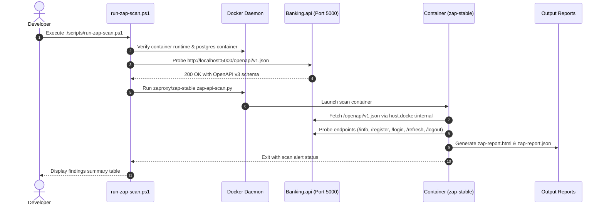

# Implementation Plan: OWASP ZAP Baseline API Security Scan (BL-QA-007 / BL-SEC-005)

- Status (2026-09-04): Deferred pending [authentication repair](plan-authentication-repair.md) and scanner safety correction. Do not execute the existing script or download its image based on this plan. Its default API-scan command lacks safe mode, and target validation is missing. This plan must be reconciled with the corrected script before separate execution approval.

Establish an automated, reproducible OWASP Zed Attack Proxy (ZAP) baseline API security assessment workflow for Banking Lab's authenticated endpoints (`/api/v1/system/info`, `/api/v1/auth/register`, `/api/v1/auth/login`, `/api/v1/auth/refresh`, `/api/v1/auth/logout`), generating standardized audit reports (HTML, JSON, Markdown).

## User Review Required

> [!IMPORTANT]
> **Container Image Pull**: Running OWASP ZAP requires pulling the official container image `ghcr.io/zaproxy/zaproxy:stable` (~1.8 GB).
>
> **Scan Scope & Safety Boundary**:
> - **Proposed passive baseline**: Use `zap-api-scan.py -S` after validating the selected version's arguments. Without `-S`, API scan performs active scanning. Even safe-mode API import can issue requests with side effects: only a disposable database with fake data is suitable. Passive alerts do not prove anti-enumeration, authorization or concurrency correctness. See [official ZAP API-scan documentation](https://www.zaproxy.org/docs/docker/api-scan/).
> - **Proposed isolation**: Validate the target, redirects and OpenAPI server URLs against explicit local destinations. Never scan the shared Chris/Gio database. The existing script defaults to port 5255 while examples below still use 5000; reconcile these before execution. Image retrieval contacts the registry and requires separate approval; local scan scope is not a claim of zero external network activity.

## Proposed Changes

### Backend API Configuration (`banking-lab/backend/Banking.api`)

#### [MODIFY] [Program.cs](file:///d:/OtherProjects/kwek-kwekBank/banking-lab/backend/Banking.api/Program.cs)
- Register `builder.Services.AddOpenApi()` and `app.MapOpenApi()`.
- Expose OpenAPI definition at `/openapi/v1.json` when running in Development/Testing environments.
- Add standard security response headers middleware (e.g. `X-Content-Type-Options: nosniff`, `X-Frame-Options: DENY`, `Referrer-Policy: strict-origin-when-cross-origin`) to pass baseline header audits cleanly.

---

### Scanning Scripts & Automation (`banking-lab/scripts`)

#### [NEW] [run-zap-scan.ps1](file:///d:/OtherProjects/kwek-kwekBank/banking-lab/scripts/run-zap-scan.ps1)
- PowerShell automation script:
  1. Checks that Docker daemon is running and healthy.
  2. Ensures the PostgreSQL container `compose-postgres-1` is running.
  3. Validates that the Banking API is running and reachable at `http://localhost:5000/openapi/v1.json` (or offers to launch it).
  4. Pulls `ghcr.io/zaproxy/zaproxy:stable` if not present.
  5. Executes `zap-api-scan.py` passing:
     - Target: `http://host.docker.internal:5000/openapi/v1.json`
     - Format: `openapi`
     - Outputs: HTML report (`zap-report.html`), JSON alert summary (`zap-report.json`), and Markdown report.
  6. Analyzes exit code and outputs a summary of findings (High, Medium, Low, Informational).

#### [NEW] [zap-rules.tsv](file:///d:/OtherProjects/kwek-kwekBank/banking-lab/scripts/zap-rules.tsv)
- Optional configuration file to define ZAP rule handling (e.g., ignore expected development-only warnings such as missing HTTPS in local non-TLS dev environments).

---

### Documentation & Deliverables (`banking-lab/docs`)

#### [NEW] [Docs/03_Walkthroughs/walkthrough-owasp-zap-baseline-scan.md](file:///d:/OtherProjects/kwek-kwekBank/banking-lab/docs/03_Walkthroughs/walkthrough-owasp-zap-baseline-scan.md)
- Walkthrough documenting the scanning procedure, command line syntax, findings analysis, and remediation steps.

---

## Step-by-Step Execution Flow

---

## Verification Plan

### Automated Checks
- Verify `GET http://localhost:5000/openapi/v1.json` returns valid OpenAPI v3 schema defining:
  - `POST /api/v1/auth/register`
  - `POST /api/v1/auth/login`
  - `POST /api/v1/auth/refresh`
  - `POST /api/v1/auth/logout`
  - `GET /api/v1/system/info`
- Run `run-zap-scan.ps1` against the running API.
- Verify `zap-report.html` and `zap-report.json` are produced with zero High or Critical vulnerabilities.

### Security Audit Assessment
- Confirm no credential exposure in logs or query strings.
- Verify presence of required security headers (`X-Content-Type-Options: nosniff`, `X-Frame-Options: DENY`).
- Review Informational and Low-risk warnings for hardening opportunities.
