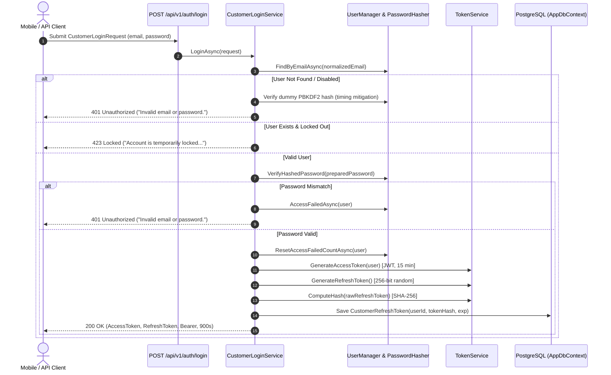

# Delivery Walkthrough: Slice 3 Customer Login, JWT Access Tokens & Rotating Refresh Tokens (BL-SEC-005)

## Overview
This walkthrough records the initial **Slice 3 Customer Login, Token Issuance, and Rotating Refresh Tokens** delivery. Review correction (2026-09-04): the implementation is partial and has unresolved security defects; see the [repair plan](../02_Planning/plan-authentication-repair.md). Results below are historical, not fresh verification or evidence of compliance with the complete BL-SEC-005 requirements.

The implementation introduces password verification, signed JWT access tokens (15-minute default), random 256-bit refresh tokens stored as SHA-256 hashes, sequential rotation and account lockout. Known gaps include a source-known signing fallback, missing email-confirmation checks, unsafe concurrent rotation, false-success logout, missing session families and missing transport/rate-limit controls. The repair proposes restoring the earlier session policy; no policy change has been implemented by this documentation correction.

---

## Key Educational Concepts

### 1. Cryptographic Token Rotation & Reuse Detection (Family Invalidation)
- **Concept**: A refresh token is a bearer credential with high privilege because it allows issuing new access tokens. If a refresh token is stolen, an attacker can maintain persistent access.
- **Rotation**: Sequential refresh marks the old token revoked and creates a replacement. Concurrent requests are not yet protected against creating multiple usable successors.
- **Reuse Detection**: Presenting a revoked token attempts to revoke all active refresh tokens for that user, not a persisted session family. A database failure can prevent revocation. Existing access JWTs are not immediately invalidated by this action; revocation-aware authorization remains part of the repair.

### 2. Timing-Attack Resistant Anti-Enumeration Authentication
- **Concept**: Account enumeration occurs when an API behaves differently (in status codes, error messages, or response times) depending on whether an email exists in the database.
- **Generic Responses**: `POST /api/v1/auth/login` returns a generic `401 Unauthorized` with ProblemDetails detail `"Invalid email or password."` regardless of whether the email was not found, the user was disabled, or the password was incorrect.
- **Timing Mitigation**: The missing/disabled-user path performs a dummy Identity password-hash check to reduce an obvious timing difference. This does not guarantee uniform execution time: database work and other branches differ. The current locked-user path also returns a distinct 423 response; generic failure behavior remains a repair item.

### 3. SHA-256 Hashed Persistence for Ephemeral Session Tokens
- **Concept**: If an attacker gains read access to the database (e.g., SQL injection, backup leak, or physical extraction), storing raw refresh tokens allows the attacker to forge active sessions.
- **Implementation**: The backend never stores plain refresh tokens in the database. When a 256-bit random refresh token is generated, its SHA-256 hash is computed. Only the hexadecimal hash string is stored in the `CustomerRefreshTokens` table. During `/refresh` or `/logout`, the incoming token is hashed and matched against the database index.

### 4. Account Lockout & Brute-Force Rate Mitigation
- **Concept**: Attackers attempt dictionary attacks by submitting thousands of password guesses against an account.
- **Implementation**: We integrate ASP.NET Core Identity's lockout policy (`LockoutEnabled = true`, `MaxFailedAccessAttempts = 5`, `DefaultLockoutTimeSpan = 15 minutes`). Each bad password increments `AccessFailedCount`. Once the threshold is reached, `IsLockedOutAsync` returns `true`, and the endpoint immediately responds with `423 Locked`, rejecting all further attempts until the lockout period expires.

---

## Sequential Architecture & Logic Flow



---

## Changes Made by File

| Path | Action | Description |
| :--- | :--- | :--- |
| `banking-lab/backend/Banking.api/Banking.api.csproj` | Modified | Added `Microsoft.AspNetCore.Authentication.JwtBearer` (10.0.11) dependency. |
| `banking-lab/backend/Banking.api/Features/Authentication/CustomerRefreshToken.cs` | Created | EF Core entity with `UserId`, `TokenHash` (unique index), `ExpiresAtUtc`, `RevokedAtUtc`, `ReplacedByTokenHash`, and lifecycle helpers (`IsActive`, `IsExpired`, `IsRevoked`). |
| `banking-lab/infrastructure/temporary/AppDbContext.cs` | Modified | Added `DbSet<CustomerRefreshToken> RefreshTokens`, configured unique index on `TokenHash`, and cascade delete with `ApplicationUser`. |
| `banking-lab/backend/Banking.api/Migrations/20260904130627_AddCustomerRefreshTokens.cs` | Created | Applied EF migration creating `CustomerRefreshTokens` table in PostgreSQL. |
| `banking-lab/backend/Banking.api/Features/Authentication/CustomerLoginContracts.cs` | Created | DTOs with `[JsonUnmappedMemberHandling(JsonUnmappedMemberHandling.Disallow)]` and redacted `ToString()`: `CustomerLoginRequest`, `CustomerLoginResponse`, `TokenRefreshRequest`, `TokenRevocationRequest`, and result objects. |
| `banking-lab/backend/Banking.api/Features/Authentication/ITokenService.cs` | Created | Contract for token generation and hashing. |
| `banking-lab/backend/Banking.api/Features/Authentication/TokenService.cs` | Created | Implements HMAC-SHA256 JWT generation with claims (`sub`, `email`, `jti`), 256-bit Base64Url refresh tokens, and SHA-256 hashing. |
| `banking-lab/backend/Banking.api/Features/Authentication/CustomerLoginService.cs` | Created | Coordinates login, lockout verification, dummy hash timing mitigation, token rotation on refresh, compromise detection, and logout. |
| `banking-lab/backend/Banking.api/Program.cs` | Modified | Configured JWT Bearer authentication, Identity lockout options (5 max failed attempts, 15 min duration), registered login services, and mapped `POST /api/v1/auth/login`, `POST /api/v1/auth/refresh`, `POST /api/v1/auth/logout`. |
| `banking-lab/backend/tests/Banking.IntegrationTests/Banking.IntegrationTests.csproj` | Modified | Added `Microsoft.EntityFrameworkCore.InMemory` (10.0.11). |
| `banking-lab/backend/tests/Banking.IntegrationTests/RegistrationTestHost.cs` | Modified | Implemented `IUserLockoutStore<ApplicationUser>` and isolated in-memory `AppDbContext` with internal service provider. |
| `banking-lab/backend/tests/Banking.IntegrationTests/TokenServiceTests.cs` | Created | 6 unit tests verifying JWT claims, signature validation, Base64Url entropy, and deterministic SHA-256 hashing. |
| `banking-lab/backend/tests/Banking.IntegrationTests/AppDbContextModelTests.cs` | Modified | Added model assertions verifying table mapping, primary key, 128-char `TokenHash` unique index, foreign key, and entity states. |
| `banking-lab/backend/tests/Banking.IntegrationTests/CustomerLoginEndpointTests.cs` | Created | 11 integration tests covering 200 OK login, 401 on bad password/email, lockout after 5 failures, 400 on extra properties, token rotation on `/refresh`, reuse compromise detection, and `/logout`. |

---

## Safe Customization Points

1. **Token Lifetimes & Signing Key**:
   Use user secrets or environment variables for a real signing secret, never tracked JSON. The following is a configuration-shape example only; do not deploy its placeholder. Current limitations: `RefreshTokenLifetimeDays` is ignored by the service (14 days is hardcoded), and the response always advertises 900 seconds even if access lifetime changes. The source fallback must be removed before deployment.
   ```json
   {
     "Jwt": {
       "SigningKey": "your-at-least-32-character-secret-key",
       "Issuer": "BankingLab",
       "Audience": "BankingMobileApp",
       "AccessTokenLifetimeMinutes": 15,
       "RefreshTokenLifetimeDays": 14
     }
   }
   ```
2. **Lockout Policy Thresholds**:
   In `Program.cs`, under `builder.Services.AddIdentityCore<ApplicationUser>(options => { ... })`:
   - `options.Lockout.MaxFailedAccessAttempts`: Adjust failed attempt threshold (currently 5).
   - `options.Lockout.DefaultLockoutTimeSpan`: Adjust lockout lock window (currently 15 minutes).

---

## Verification Results

### Automated Backend Tests
Command: `dotnet test`
```text
Passed!  - Failed:     0, Passed:   111, Skipped:     0, Total:   111, Duration: 2 s - Banking.IntegrationTests.dll (net10.0)
```

### Automated Mobile Tests
Command: `flutter test`
```text
All tests passed! (54 tests passing)
```

### Database Schema Verification
- Migration `20260904130627_AddCustomerRefreshTokens` successfully applied to PostgreSQL container (`compose-postgres-1`).
- Table `CustomerRefreshTokens` verified in PostgreSQL.
